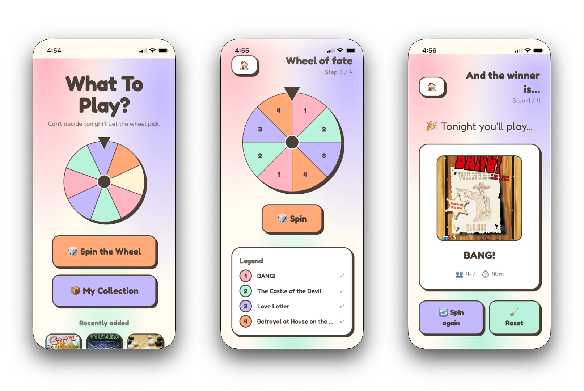
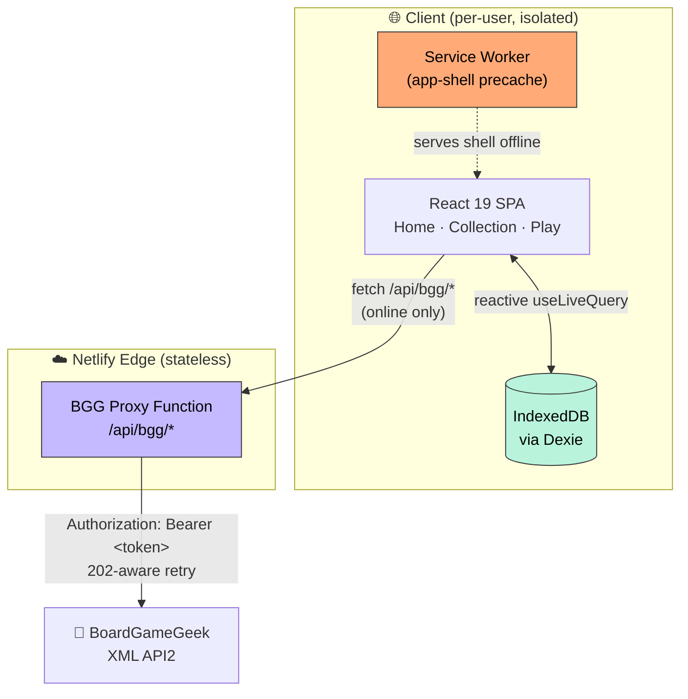

# What To Play? 🎲

<p align="center">
  
</p>

> A **local-first Progressive Web App** that settles _"what should we play tonight?"_ for board-game groups — every player curates a private collection in their own browser, and a **weighted probability wheel** makes the final, unbiased call. No accounts, no backend, works offline.



<p align="center">
  <a href="#tech-stack--architecture">Architecture</a> ·
  <a href="#getting-started">Getting Started</a> ·
  <a href="#technical-challenges--solutions">Technical Deep-Dive</a> ·
  <a href="#testing--code-quality">Testing</a>
</p>

---

## What I learned

This was my second AI-assisted project. After finishing my first project (CardIO, a card collection manager), I realized these projects could be a genuine learning vehicle — not just a way to ship something, but a way to explore how AI approaches technical decisions I wouldn't otherwise encounter.

The idea came from a real annoyance: with nearly 50 board games at home, every game night started with 20–30 minutes of debating what to play based on player count and time available. The scope was simple enough that I could have written it myself in a familiar way — but I used this project as a chance to learn, not just to ship.

I started by defining constraints on purpose. I chose Netlify for deployment specifically because it was different from my first project, so I'd learn how platforms differ. For the framework, I stuck with React, which I already use for my personal site, so I'd never be completely lost reading the code.

From there, I worked through the architecture with AI, treating it like a design conversation rather than a black box — asking about each option's tradeoffs before committing. Outside of my personal site, a Streamlit app, and my first full-stack project, I had little full-stack experience, and I'd never considered building a site with no backend at all. Learning about offline-first PWAs and IndexedDB — where data lives on the user's device rather than in a cloud database, and computation happens locally — was genuinely exciting. Even so, the one authenticated third-party API (BoardGameGeek) still needed a small serverless proxy to hide its token and bypass CORS — which taught me that "no backend" rarely means "no server code at all." My coursework had given me the underlying language and algorithmic fundamentals, and online tutorials had taught me a couple of standard full-stack patterns, but working with AI tied those pieces together with the kind of practical judgment that usually comes only from real-world experience.

Beyond the architecture itself, a few details stood out as things I hadn't expected to learn this early:

- **Accessibility isn't optional.** Screen readers and other assistive needs matter for any real deployment — even for small or unpaid tools, not just commercial software. It's a consideration I'll now carry into every project, solo or collaborative.
- **Local storage has a few failure modes.** iOS Safari clears all writable local storage after seven days of inactivity, and while browsers like Chrome and Firefox are less aggressive, they can still evict data under storage pressure. These are the kinds of edge cases I'd probably have discovered only the hard way in a real production setting — but here, the AI coding agent flagged them up front.

Small details like these are usually hard to learn without hands-on production experience. Building this way meant they surfaced naturally during the project, reinforcing concepts I'd learned before and building intuition I wouldn't otherwise have had this early in my path.

### A note on the logo

The one part of this project that's entirely mine: I designed the logo myself. It reuses the app's exact palette, and frames **four rounded tiles as a stand-in for a shelf full of games**. The top-right tile is rotated 15° — it's the one that's just been _picked_. Which game is it? That's precisely what **What To Play?** is here to decide.

---

## Why this exists

Board-game night stalls on the same problem every time: five people, forty games, zero consensus. Existing collection trackers (BoardGameGeek included) are catalogs, not deciders — and they demand accounts and cloud sync for what is fundamentally a private, ephemeral list.

**What To Play?** inverts that. It's a **zero-backend, privacy-by-architecture** picker: your collection never leaves your device, yet the app is fully shareable by URL — each visitor gets their own isolated library. The decision itself is delegated to a tunable weighted wheel, so "the app chose it" replaces "we argued for twenty minutes."

---

## Key Features

- **🎡 Weighted probability wheel with deterministic landing.** Each candidate is assigned a weight (`0.5×`–`3×`); the winner is drawn from the resulting probability distribution, and the spin animation is computed to land _exactly_ on the pre-selected slice — decoupling the random outcome from the render so the visual and logical results can never disagree (see [Technical Deep-Dive](#technical-challenges--solutions)).
- **📴 Offline-first PWA.** A Workbox service worker precaches the app shell; the collection lives in IndexedDB. The entire app — browse, filter, spin — works with the network fully disconnected. BGG auto-fill is the only online-only feature and degrades gracefully to manual entry.
- **🔒 Privacy by architecture, not policy.** No accounts, no server database. Each browser's IndexedDB is an isolated data island, so cross-user data exposure is _structurally impossible_ rather than merely access-controlled.
- **🔌 Resilient BoardGameGeek integration.** A single, environment-agnostic client handles BGG's quirky XML API — including its **HTTP 202 "request queued" async pattern** — behind a serverless proxy that hides the API token and neutralizes CORS. Search results are re-ranked client-side because BGG sorts by popularity, not relevance.
- **♻️ Portable data ownership.** One-click JSON export routes through the native **Web Share Sheet** on mobile (AirDrop, Drive, Mail) with a download fallback; import performs an idempotent merge (existing IDs skipped, not duplicated).
- **🛡️ Production-grade resilience & durability.** A top-level React Error Boundary replaces white-screen crashes; the app requests **persistent storage** and nudges iOS users to "Add to Home Screen" to survive Safari's 7-day storage eviction.
- **♿ Accessibility built in.** Keyboard-operable card selection, `aria-live` announcement of the wheel result for screen readers, and semantic dialog roles.

---

## Tech Stack & Architecture

| Layer | Technology | Rationale |
|---|---|---|
| **UI** | React 19 + TypeScript (strict) | Concurrent rendering; end-to-end type safety |
| **Styling** | Tailwind CSS v4 | Utility-first, zero runtime cost |
| **Build** | Vite 8 | Sub-300 ms production builds, first-class code splitting |
| **Persistence** | IndexedDB via [Dexie](https://dexie.org/) + `dexie-react-hooks` | Reactive local queries; no server round-trips |
| **Animation** | framer-motion | Physics-based wheel spin (lazy-loaded) |
| **Routing** | react-router 7 | Client-side SPA routing |
| **Offline** | vite-plugin-pwa (Workbox) | App-shell precache + runtime caching strategy |
| **Backend (edge)** | Netlify Functions (v2, Web-standard `Request`/`Response`) | Stateless BGG proxy — token isolation + CORS bypass |
| **Testing** | Vitest | Fast, Vite-native unit tests |

### System Architecture



**How the modules collaborate**

- The **SPA** is the whole application; all game data reads/writes flow through a thin repository layer ([`src/lib/repo.ts`](src/lib/repo.ts)) so components never touch Dexie directly. `useLiveQuery` makes the UI reactive to IndexedDB — a mutation anywhere re-renders every dependent view with no manual state plumbing.
- The **service worker** precaches the shell so navigation works offline; only `/api/bgg/*` is forced `NetworkOnly`.
- The **BGG proxy** is a stateless edge function. Critically, its parsing/ranking logic lives in an **environment-agnostic core** ([`src/lib/bgg-core.ts`](src/lib/bgg-core.ts)) that is imported by _both_ the Netlify Function (production) and a Vite dev-server middleware (local) — so dev and prod are guaranteed byte-for-byte identical, eliminating environment drift.

---

## Getting Started

### Prerequisites

- **Node.js ≥ 20** (Vite 8 requirement)
- A **BoardGameGeek API token** — _optional_. Without it the app runs fully; you just lose BGG auto-fill and enter game details manually.

### Installation

```bash
git clone https://github.com/luluwu516/what-to-play.git
cd what-to-play
npm install

cp .env.example .env.local        # then paste your BGG token into it
npm run dev                       # → http://localhost:5173
```

`.env.local` (git-ignored):

```dotenv
# BGG XML API2 authenticated access token
BGG_API_TOKEN=your_token_here
```

### Deployment (Netlify)

Build command, publish directory, and SPA fallback are already declared in [`netlify.toml`](netlify.toml). Connect the repo in Netlify, set `BGG_API_TOKEN` under **Site settings → Environment variables**, and deploy. The token stays server-side — it is never shipped in the client bundle.

---

## Technical Challenges & Solutions

### 1. Making a random outcome and its animation provably agree

**The problem.** A weighted wheel has two sources of truth that must never diverge: the _logical_ winner (drawn from a probability distribution) and the _visual_ winner (the slice that ends up under the pointer). The naive approach — spin by a random amount, then read the final rotation to see "where it landed" — is fragile: it couples the result to floating-point rotation math and animation timing, and any rounding error silently declares the wrong winner. It's a classic render/state race.

**How I approached it.** I inverted the dependency: **decide first, then animate to the decision.**

1. Weights are expanded into discrete slices via a **round-robin interleave** so a `1×`/`2×` split renders as `A,B,A,B,B,B` rather than clumping — visually fair, and extracted into a pure function ([`src/lib/wheel.ts`](src/lib/wheel.ts)) precisely so it's unit-testable in isolation.
2. The winner is chosen up front by uniform selection over the expanded slices (weighting falls out of the expansion).
3. The target rotation is then computed backwards from that winner: normalize the current angle `mod 360`, solve for the delta that parks the winning slice's center under the fixed pointer, force the wheel to always travel **forward** (`if (delta <= 0) delta += 360`), and add 5–8 full turns plus sub-slice jitter for a natural feel.

**The outcome.** The result is authoritative _before_ a single frame renders; the animation is a pure function of that decision. There is no post-hoc DOM measurement and therefore **no race condition and zero rounding-induced mismatches** — the logical and visual winners are identical by construction. The extraction also let me lock the behavior down with tests covering slice counts, interleaving order, and index mapping.

### 2. One BGG client, two runtimes, and a hostile-internet-facing proxy

**The problem.** BoardGameGeek's XML API can't be called from the browser (CORS + an auth token that must not ship to clients), so it needs a proxy. But a proxy introduces three hazards: (a) **logic drift** between the local dev experience and the deployed function; (b) BGG's **asynchronous 202 pattern**, where the API returns `202 Accepted` and expects you to poll until the data is ready; and (c) a **publicly reachable endpoint** that, left open, is a free BGG proxy for anyone who finds it — and a way to exhaust my token's rate limit.

**How I solved it.**

- **Single source of truth across runtimes.** All fetch + XML-parse + relevance-ranking logic is a **pure, `process.env`-free module** ([`bgg-core.ts`](src/lib/bgg-core.ts)). The Netlify Function and the Vite dev middleware are thin adapters over it, so `/api/bgg/*` behaves identically in both environments — dev/prod drift is impossible by design.
- **202-aware resilience.** The fetch layer detects `202`, backs off, and retries with a bounded ceiling, converting BGG's queue-and-poll contract into a clean `Promise` the UI can simply `await`. Results are re-ranked because BGG returns by internal popularity, not string relevance.
- **Cheap, correct abuse deterrence.** Rather than reach for heavyweight auth on a hobby app, I gate the endpoint with **Fetch Metadata** (`Sec-Fetch-Site`, which scripts cannot forge) plus an `Origin`/`Referer` fallback, and bound the inputs (`q` length, numeric `id` range) so malformed or oversized requests never reach BGG. This stops the realistic threat — drive-by reuse and casual scraping — with a few lines and no added latency ([`netlify/shared/guard.ts`](netlify/shared/guard.ts)).

---

## Testing & Code Quality

The project treats the **pure, high-risk logic** as the test surface — the code most likely to regress and cheapest to cover: probability-slice expansion, the "new game" time-window rules, BGG relevance ranking, and import-file validation/merging.

```bash
npm test          # Vitest — unit suite (21 tests)
npm run lint      # ESLint (flat config)
npm run build     # Strict tsc type-check + production build
```

| Gate | Tooling | Enforces |
|---|---|---|
| **Type safety** | TypeScript (strict, `noUnusedLocals`, `verbatimModuleSyntax`) | No `any`-drift; compile-time correctness |
| **Static analysis** | ESLint + `react-hooks` rules | Hook correctness, dead code |
| **Unit tests** | Vitest | Deterministic core logic (weights, wheel, ranking, import) |

These three commands are self-contained and CI-ready — they form the exact quality gate a GitHub Actions pipeline would run on every pull request.

---

## Project Layout

```
src/
  lib/
    db.ts          # Dexie schema (single `games` table)
    repo.ts        # Repository layer — the only path to IndexedDB
    types.ts       # Canonical Game record + derived shape
    weight.ts      # "New" badge + default-weight rules
    wheel.ts       # Pure weight → slice expansion (unit-tested)
    bgg-core.ts    # Env-free BGG fetch + parse + rank (shared: fn AND dev)
    bgg-client.ts  # Browser adapter → /api/bgg/*
    storage.ts     # Persistent-storage request (eviction resistance)
  components/      # Wheel, GameCard, BGGSearchBox, ErrorBoundary, InstallHint…
  pages/           # Home · Collection · CollectionAdd · Play
  App.tsx          # Routes (Play lazy-loaded to split framer-motion)
netlify/
  functions/       # bgg-search.ts, bgg-thing.ts  (Web-standard handlers)
  shared/guard.ts  # Same-origin + input-bounds proxy hardening
vite.config.ts     # PWA config + BGG proxy mounted as dev middleware
```

---

## Data Ownership & Recovery

There is no server backup — that's the point. Your data is yours, on your device.

- **Back up / move devices:** Collection → **⬇ Export / Share** → JSON.
- **Restore:** Collection → **⬆ Import JSON** (idempotent merge).
- **Migrate from the v1 server-side SQLite build:**
  ```bash
  node scripts/dump-from-v1.mjs path/to/wellwheel.db > seed-from-v1.json
  # then Import JSON in the app
  ```

---

<p align="center"><sub>Built with React 19, TypeScript & Claude Opus 4.8.</sub></p>
