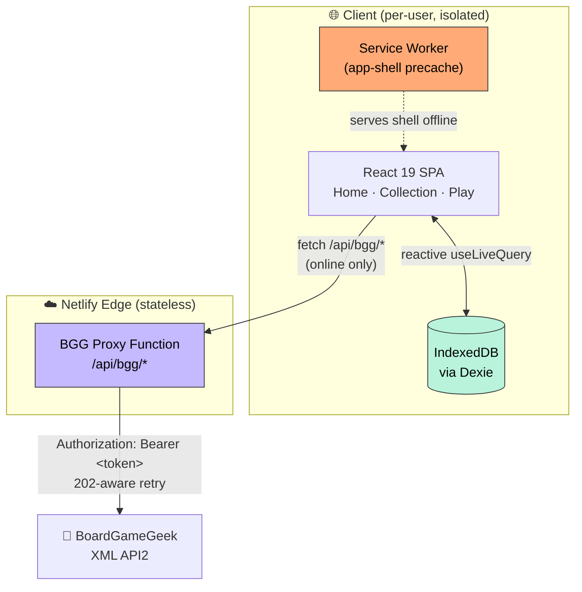

# What To Play? 🎲

<p align="center">
  
</p>

> A **local-first Progressive Web App** that settles _"what should we play tonight?"_ for board-game groups. Every player curates a private collection in their own browser, and a **weighted probability wheel** makes the call. No accounts, no backend, works offline.


<p align="center">
  <a href="#tech-stack--architecture">Architecture</a> ·
  <a href="#getting-started">Getting Started</a> ·
  <a href="#technical-challenges--solutions">Technical Deep-Dive</a> ·
  <a href="#testing--code-quality">Testing</a>
</p>

---

## What I learned

This was my second AI-assisted project. After finishing CardIO, a card collection manager, I saw these projects as a way to study how AI approaches technical decisions I would not run into on my own.

The idea came from an annoyance at home: with nearly 50 board games on the shelf, game night opened with 20–30 minutes of debate over player count and time available. The scope was small enough that I could have written it myself in a familiar way. I used it to learn instead.

I set constraints on purpose. I picked Netlify for deployment because it differed from my first project, so I would learn how platforms compare. For the framework I stayed with React, which I already use for my personal site, so the code stayed readable to me.

From there I worked through the architecture with AI as a design conversation rather than a black box, asking about each option's tradeoffs before committing. My full-stack experience amounted to a personal site, a Streamlit app, and CardIO, and I had not considered building a site with no backend at all. Offline-first PWAs and IndexedDB opened that up: the data lives on the user's device instead of a cloud database, and the computation happens in the browser. One exception survived. BoardGameGeek requires an auth token, so it still needed a small serverless proxy to hide that token and bypass CORS, which taught me that "no backend" means "less server code," not none. Coursework gave me the language and algorithm fundamentals, and tutorials gave me a few standard full-stack patterns. Working with AI connected those pieces to the practical judgment that tends to come from shipping.

Two details stood out as things I did not expect to learn at this stage:

- **Accessibility counts from the start.** Screen readers and other assistive needs matter for anything you deploy, including small unpaid tools. I carry it into my projects now, solo or collaborative.
- **Local storage fails in ways I had not anticipated.** iOS Safari clears script-writable storage after seven days of inactivity. Chrome and Firefox hold on longer but still evict under storage pressure. I would have found both of these in production the hard way. The AI coding agent raised them before I shipped.

Details like these are hard to pick up without production experience. Building this way surfaced them during the project, which reinforced what I already knew and gave me intuition I would not have at this stage.

### A note on the logo

The logo is mine, the one piece of this project I designed myself. It reuses the app's palette and frames **four rounded tiles as a stand-in for a shelf of games**. The top-right tile sits rotated 15°, because that one has been _picked_. **What To Play?** exists to decide which one it is.

---

## Why this exists

You sit down for game night and lose the first twenty minutes to the same problem: five people, forty games, no consensus. Collection trackers, BoardGameGeek included, catalog games without choosing one for you, and they ask for an account and cloud sync to hold a list that stays private and stops mattering by Sunday.

**What To Play?** turns that around. Your collection stays in your browser, and the app still shares by URL, because each visitor gets an isolated library of their own. A tunable weighted wheel makes the choice, so "the app picked it" replaces twenty minutes of arguing.

---

## Key Features

- **🎡 Weighted probability wheel with deterministic landing.** You give each candidate a weight (`0.5×`–`3×`), the app draws the winner from that distribution, then computes the spin to land on the slice it already chose. Separating the draw from the render keeps the visual and logical winners identical (see [Technical Deep-Dive](#technical-challenges--solutions)).
- **📴 Offline-first PWA.** A Workbox service worker precaches the app shell and the collection lives in IndexedDB, so browse, filter, and spin all work with the network disconnected. BGG auto-fill needs the network and falls back to manual entry.
- **🔒 Privacy by architecture.** No accounts, no server database. Each browser's IndexedDB is an isolated island, so one user cannot reach another's data at all, and there is no access-control layer to misconfigure.
- **🔌 Resilient BoardGameGeek integration.** One environment-agnostic client handles BGG's XML API, including its **HTTP 202 "request queued" async pattern**, behind a serverless proxy that hides the API token and clears CORS. The client re-ranks search results because BGG sorts by popularity instead of relevance.
- **♻️ Portable data ownership.** JSON export routes through the native **Web Share Sheet** on mobile (AirDrop, Drive, Mail) with a download fallback. Import performs an idempotent merge and skips IDs the collection already holds.
- **🛡️ Resilience and durability.** A top-level React Error Boundary turns white-screen crashes into a recoverable message. The app requests **persistent storage** and prompts iOS users to "Add to Home Screen" to survive Safari's 7-day eviction.
- **♿ Accessibility built in.** Keyboard-operable card selection, an `aria-live` announcement of the wheel result for screen readers, and semantic dialog roles.

---

## Tech Stack & Architecture

| Layer | Technology | Rationale |
|---|---|---|
| **UI** | React 19 + TypeScript (strict) | Concurrent rendering; end-to-end type safety |
| **Styling** | Tailwind CSS v4 | Utility-first, zero runtime cost |
| **Build** | Vite 8 | Sub-300 ms production builds, first-class code splitting |
| **Persistence** | IndexedDB via [Dexie](https://dexie.org/) + `dexie-react-hooks` | Reactive local queries; no server round-trips |
| **Animation** | framer-motion | Physics-based wheel spin (lazy-loaded) |
| **Routing** | react-router 7 | Client-side SPA routing |
| **Offline** | vite-plugin-pwa (Workbox) | App-shell precache + runtime caching strategy |
| **Backend (edge)** | Netlify Functions (v2, Web-standard `Request`/`Response`) | Stateless BGG proxy: token isolation + CORS bypass |
| **Testing** | Vitest | Fast, Vite-native unit tests |

### System Architecture



**How the modules collaborate**

- The **SPA** is the whole application. All game data reads and writes flow through a thin repository layer ([`src/lib/repo.ts`](src/lib/repo.ts)), so no component talks to Dexie itself. `useLiveQuery` makes the UI reactive to IndexedDB: a mutation anywhere re-renders each dependent view with no manual state plumbing.
- The **service worker** precaches the shell so navigation works offline. Only `/api/bgg/*` is forced `NetworkOnly`.
- The **BGG proxy** is a stateless edge function. Its parsing and ranking logic lives in an **environment-agnostic core** ([`src/lib/bgg-core.ts`](src/lib/bgg-core.ts)) that both the Netlify Function (production) and a Vite dev-server middleware (local) import, so dev and prod stay byte-for-byte identical and environment drift cannot creep in.

---

## Getting Started

### Prerequisites

- **Node.js ≥ 20** (Vite 8 requirement)
- A **BoardGameGeek API token**, optional. Without it the app still runs; you enter game details by hand instead of auto-filling them from BGG.

### Installation

```bash
git clone https://github.com/luluwu516/what-to-play.git
cd what-to-play
npm install

cp .env.example .env.local        # then paste your BGG token into it
npm run dev                       # → http://localhost:5173
```

`.env.local` (git-ignored):

```dotenv
# BGG XML API2 authenticated access token
BGG_API_TOKEN=your_token_here
```

### Deployment (Netlify)

Build command, publish directory, and SPA fallback are already declared in [`netlify.toml`](netlify.toml). Connect the repo in Netlify, set `BGG_API_TOKEN` under **Site settings → Environment variables**, and deploy. The token stays server-side and never reaches the client bundle.

---

## Technical Challenges & Solutions

### 1. Keeping a random outcome and its animation in agreement

**The problem.** A weighted wheel has two sources of truth that have to agree: the _logical_ winner, drawn from a probability distribution, and the _visual_ winner, the slice that stops under the pointer. The naive approach spins by a random amount and then reads the final rotation to see where it landed. That couples the result to floating-point rotation math and animation timing, so one rounding error hands the win to the wrong slice. It is a render/state race.

**How I approached it.** I inverted the dependency: **decide first, then animate to the decision.**

1. Weights expand into discrete slices through a **round-robin interleave**, so a `1×`/`2×` split renders as `A,B,A,B,B,B` instead of clumping. It reads as fair on screen, and it lives in a pure function ([`src/lib/wheel.ts`](src/lib/wheel.ts)) so I can unit-test it in isolation.
2. The winner comes from a uniform draw over the expanded slices, and the weighting falls out of the expansion.
3. The target rotation is then computed backwards from that winner: normalize the current angle `mod 360`, solve for the delta that parks the winning slice's center under the fixed pointer, force the wheel to travel forward (`if (delta <= 0) delta += 360`), and add 5–8 full turns plus sub-slice jitter for a natural feel.

**The outcome.** The result is settled _before_ a single frame renders, and the animation is a pure function of that decision. Nothing measures the DOM after the fact, so **the logical and visual winners match by construction**. Extracting the expansion also let me lock the behavior down with tests on slice counts, interleaving order, and index mapping.

### 2. One BGG client, two runtimes, and an internet-facing proxy

**The problem.** BoardGameGeek's XML API cannot be called from the browser, because of CORS and an auth token that must not ship to clients, so it needs a proxy. A proxy introduces three hazards: (a) **logic drift** between the local dev experience and the deployed function, (b) BGG's **asynchronous 202 pattern**, where the API returns `202 Accepted` and expects you to poll until the data is ready, and (c) an **endpoint anyone can reach** that, left open, becomes a free BGG proxy for anyone who finds it and a way to burn through my token's rate limit.

**How I solved it.**

- **Single source of truth across runtimes.** All fetch, XML-parse, and relevance-ranking logic sits in a **pure, `process.env`-free module** ([`bgg-core.ts`](src/lib/bgg-core.ts)). The Netlify Function and the Vite dev middleware are thin adapters over it, so `/api/bgg/*` behaves the same in both environments and dev/prod drift cannot happen by design.
- **202-aware resilience.** The fetch layer detects `202`, backs off, and retries up to a bounded ceiling, which converts BGG's queue-and-poll contract into a `Promise` the UI can `await`. It re-ranks results afterward, because BGG returns them by internal popularity rather than string relevance.
- **Cheap, correct abuse deterrence.** Instead of reaching for heavyweight auth on a hobby app, I gate the endpoint with **Fetch Metadata** (`Sec-Fetch-Site`, which scripts cannot forge) plus an `Origin`/`Referer` fallback, and I bound the inputs (`q` length, numeric `id` range) so malformed or oversized requests never reach BGG. That stops the realistic threat, drive-by reuse and casual scraping, in a few lines and with no added latency ([`netlify/shared/guard.ts`](netlify/shared/guard.ts)).

---

## Testing & Code Quality

The project treats the **pure, high-risk logic** as the test surface, the code most likely to regress and cheapest to cover: probability-slice expansion, the "new game" time-window rules, BGG relevance ranking, and import-file validation and merging.

```bash
npm test          # Vitest unit suite (21 tests)
npm run lint      # ESLint (flat config)
npm run build     # Strict tsc type-check + production build
```

| Gate | Tooling | Enforces |
|---|---|---|
| **Type safety** | TypeScript (strict, `noUnusedLocals`, `verbatimModuleSyntax`) | No `any`-drift; compile-time correctness |
| **Static analysis** | ESLint + `react-hooks` rules | Hook correctness, dead code |
| **Unit tests** | Vitest | Deterministic core logic (weights, wheel, ranking, import) |

These three commands are self-contained and CI-ready: they form the quality gate a GitHub Actions pipeline would run on each pull request.

---

## Project Layout

```
src/
  lib/
    db.ts          # Dexie schema (single `games` table)
    repo.ts        # Repository layer, the only path to IndexedDB
    types.ts       # Canonical Game record + derived shape
    weight.ts      # "New" badge + default-weight rules
    wheel.ts       # Pure weight → slice expansion (unit-tested)
    bgg-core.ts    # Env-free BGG fetch + parse + rank (shared: fn AND dev)
    bgg-client.ts  # Browser adapter → /api/bgg/*
    storage.ts     # Persistent-storage request (eviction resistance)
  components/      # Wheel, GameCard, BGGSearchBox, ErrorBoundary, InstallHint…
  pages/           # Home · Collection · CollectionAdd · Play
  App.tsx          # Routes (Play lazy-loaded to split framer-motion)
netlify/
  functions/       # bgg-search.ts, bgg-thing.ts  (Web-standard handlers)
  shared/guard.ts  # Same-origin + input-bounds proxy hardening
vite.config.ts     # PWA config + BGG proxy mounted as dev middleware
```

---

## Data Ownership & Recovery

No server backup exists, by design. Your data stays on your device.

- **Back up / move devices:** Collection → **⬇ Export / Share** → JSON.
- **Restore:** Collection → **⬆ Import JSON** (idempotent merge).
- **Migrate from the v1 server-side SQLite build:**
  ```bash
  node scripts/dump-from-v1.mjs path/to/wellwheel.db > seed-from-v1.json
  # then Import JSON in the app
  ```

---

<p align="center"><sub>Built with React 19, TypeScript & Claude Opus 4.8.</sub></p>
